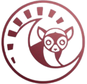

  

*“Ogni passo in avanti è un motivo in meno per tornare indietro”*

 

<a href="#about">About</a> •
<a href="#stack">Stack</a> •
<a href="#projects">Projects</a> •
<a href="#stats">Stats</a> •
<a href="#connect">Connect</a>

## 🧑‍💻 About Me

  

📄 Versione testuale

 

- 🎓 **Computer Engineering student** @ Politecnico di Torino
- 🌍 Interests: **data analysis**, **computer science**, **climate change**
- 🛰️ Building code that's flown on the ISS with ESA's Astro Pi programme
- 📌 Roots in Cuneo, studying in Torino

## 🛠️ Tech Stack & Tools

**Languages** 

  

**Data & Analysis** 

  

**Tools & OS** 

## 🚀 Featured Projects

<table width="100%">
<tr>
<td width="50%" valign="top">

### 🛰️ Astro Pi Mission Space Lab
Python code developed to calculate the speed and altitude of the International Space Station (ISS) directly on board, analyzing live sensor data.

`Python` `ESA` `Sensor Data`
</td>
<td width="50%" valign="top">

### 📚 ITIS Notes
A curated collection of study notes and project materials from my high school years in Cuneo, shared to help others out.

`Study Notes` `Open Source`
</td>
</tr>
</table>

## 📊 GitHub Stats

  

<!-- 
I seguenti widget (Trophies e Activity Graph) sono temporaneamente disattivati 
perché i loro server restituiscono l'errore HTTP 402 (Payment Required). 

  

 

-->

  

<picture>
  <source media="(prefers-color-scheme: dark)" srcset="https://raw.githubusercontent.com/Lespyy/Danilo-Rinaldi.github.io/output/github-contribution-grid-snake-dark.svg">
  <source media="(prefers-color-scheme: light)" srcset="https://raw.githubusercontent.com/Lespyy/Danilo-Rinaldi.github.io/output/github-contribution-grid-snake.svg">
  
</picture>

  

## 📫 Let's Connect

  

⭐ come see my repos — <a href="#top">back to top</a>

